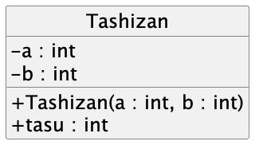
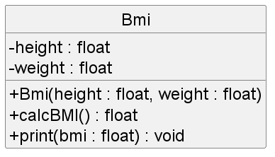

author: Kanta Toda
summary: WorkSheet
id: WorkSheet
categories: codelab, markdown, java
environments: Web
status: Published
feedback link: mailto:java-prog-qa@techitose.org 

# ベーシッククラスレベル向け）Javaプログラミング補習教材


## この教材の目的

Javaプログラミングでは、**クラスの構造を理解した上で、自分でクラスを作れること** がとても重要になります。

指示どおりにクラスを作る練習をした上で、実際に自分でクラスを作ることができるか、問いで確認しましょう。

### 練習問題

<aside>

足し算を行うクラスを作成しなさい。

足し算クラスは、2つの32ビット整数をデータとして持つ。また、このデータを使って足し算の結果を答える機能を持つ。

足し算クラスのデータは、インスタンス化時に初期化する。

最後に、Mainクラスで、標準入力から2つの数値を入力し、足し算クラスで計算が実行されるようにしなさい。

</aside>

次ページからは、この問題文を解くにあたっての解説です。まずは、**問題文と解説を照らし合わせ、どのように記述すれば良いか確認した上で、あなたも同じように書いてみましょう** 。

## 練習：クラスを作成する

<aside>

**足し算を行うクラスを作成しなさい。**

足し算クラスは、2つの32ビット整数をデータとして持つ。また、このデータを使って足し算の結果を答える機能を持つ。

足し算クラスのデータは、インスタンス化時に初期化する。

最後に、Mainクラスで、標準入力から2つの数値を入力し、足し算クラスで計算が実行されるようにしなさい。

</aside>

問題文では `足し算を行うクラスを作成しなさい` と指示されています。

**クラスを作成する** ことは、`.java` ファイルの中に、`class` **というキーワードを使い、ブロック** `{  }` を記述することから始まります。

**Tashizan.java というファイルを新規作成し**、Tashizan クラスを作り始めましょう。

```java

public class Tashizan {

    // ここに、クラスの内容を書きます。

}

```

これにより、足し算を行うための `Tashizan` クラスの土台ができました。

<aside class="negative">

classの前に `public` とついています。

これは、**Tashizan クラス自体を外部から使えるようにするための設定キーワード（アクセス修飾子）** です。

詳しくは、教科書を読み直してみましょう。

</aside>


## 練習：クラスにデータを持たせる

<aside>

足し算を行うクラスを作成しなさい。

**足し算クラスは、2つの32ビット整数をデータとして持つ。** また、このデータを使って足し算の結果を答える機能を持つ。

足し算クラスのデータは、インスタンス化時に初期化する。

最後に、Mainクラスで、標準入力から2つの数値を入力し、足し算クラスで計算が実行されるようにしなさい。

</aside>

次に、問題文では `足し算クラスは、2つの32ビット整数をデータとして持つ` と指示されています。

**クラスにデータを持たせる** とは、クラスの内容に **フィールド変数** を記述することです。

**フィールド変数は、クラスのブロックに直接、変数のように記述**します。

Tashizan クラスに、32ビット整数を表す `int` 型を使ったフィールド変数を **まずは1つ、記述**しましょう。


```java

public class Tashizan {

    private int a;

}

```

`a` という `int` 型のフィールド変数を記述しました。

今回の問題文では、`足し算クラスは、2つの32ビット整数をデータとして持つ` と指示されているので、もう1つフィールド変数が必要です。記述しましょう。

```java

public class Tashizan {
    
    private int a;
    private int b;

}

```

`b` という `int` 型のフィールド変数を記述しました。

`a`, `b` という2つの `int` 型のフィールド変数が記述されることで、 `足し算クラスは、2つの32ビット整数をデータとして持つ` ことができるようになりました。

<aside class="negative">

フィールド変数の前に `private` とついています。

これは、**フィールド変数 a, b を、クラスの内部からのみ使えるようにするための設定キーワード（アクセス修飾子）** です。

詳しくは、教科書を読み直してみましょう。

</aside>


## 練習：クラスに機能を持たせる

<aside>

足し算を行うクラスを作成しなさい。

足し算クラスは、2つの32ビット整数をデータとして持つ。また、**このデータを使って足し算の結果を答える機能を持つ。**

足し算クラスのデータは、インスタンス化時に初期化する。

最後に、Mainクラスで、標準入力から2つの数値を入力し、足し算クラスで計算が実行されるようにしなさい。

</aside>

次に、問題文では `このデータを使って足し算の結果を答える機能を持つ` と指示されています。

データとは、前の練習のパートで作成した `a`, `b` のフィールド変数のことです。

**クラスに機能を持たせる** とは、クラスの内容に **メソッド** を記述することです。

**メソッドは、クラスのブロックの中に処理ブロック** `{  }` **として記述**します。

Tashizan クラスに、**データを使って足し算をする** `tasu()` **メソッド**を作成しましょう。


```java

public class Tashizan {
    
    private int a;
    private int b;

　　public void tasu() {
        int ans = a + b;
    }

}
```

`tasu()` というメソッドを作成し、その中で `a`, `b` の足し算の結果を `ans` に格納するメソッドを作成しました。

`void` とは、戻り値を返さないメソッドであることを表すキーワードです。しかし、問題文では `足し算の結果を答える` と指示されています。

結果を答えるためには、**メソッドに戻り値の型を指定** した上で、 **処理結果を** `return` **する** ように記述します。

```java
public class Tashizan {
    
    private int a;
    private int b;

　　public int tasu() {
        int ans = a + b;
        return ans;
    }

}
```

`void` を戻り値となる計算結果 `ans` の型である `int` に変換し、また計算結果自体を `return` するように記述を書き換えました。

<aside class="negative">

メソッドの `()` には、引数を指定することもできます。

たとえば、**フィールド変数と、クラスの外の別のデータを組み合わせた処理** が必要な場合に使います。

詳しくは、教科書を読み直してみましょう。

</aside>


## 練習：インスタンス化時に初期化する

<aside>

足し算を行うクラスを作成しなさい。

足し算クラスは、2つの32ビット整数をデータとして持つ。また、このデータを使って足し算の結果を答える機能を持つ。

**足し算クラスのデータは、インスタンス化時に初期化する。**

最後に、Mainクラスで、標準入力から2つの数値を入力し、足し算クラスで計算が実行されるようにしなさい。

</aside>

次に、問題文では `足し算クラスのデータは、インスタンス化時に初期化する` と指示されています。

足し算クラスのデータとは、フィールド変数のことでしたね。

**インスタンス化は、クラスをプログラム上で使える（メモリを確保する）** ための処理で、この時に**コンストラクタという特別なメソッドを実行**できます。

つまり  **データを、インスタンス化時に初期化する** とは、**コンストラクタでフィールド変数を設定する** ように記述します。

また、**コンストラクタは、フィールド変数やメソッドの間に、クラス名と同じ名前** で記述します。

```java
public class Tashizan {
    
    private int a;
    private int b;

    public Tashizan(int a, int b) {
        this.a = a;
        this.b = b;
    }

　　public int tasu() {
        int ans = a + b;
        return ans;
    }

}
```

`Tashizan(int a, int b)` コンストラクタを作成しました。

このコンストラクタは、引数の `a`, `b` の値を使って、Tashizanクラスのフィールド変数 `a`, `b` を設定します。


<aside class="negative">

コンストラクタの中に `this.a` というものがあります。

メソッドやコンストラクタの中で、引数とフィールド変数の名前が同じになる場合、`this` は `このクラスのフィールド変数` であるということを表します。

たとえば、 `this.a = a` は「`フィールド変数a` を、`引数 a` の中身と同じものにする」という意味になります。

メソッドやコンストラクタの中で、どの変数がフィールド変数で、どの変数が引数か分かりづらい時には、フィールド変数の方に `this` をつけるようにしましょう。

</aside>


## 練習：mainメソッドからクラスを使う

Hosyu0クラスを作成し、プログラムを実行するための main メソッドを用意します。


### mainメソッドの準備

```java
public class Hosyu {

  public static void main(String[] args) {
    // 実行するプログラムの内容
  }
  
}
```

<aside class="negative">

#### 復習

`public static void main(String[] arg)` メソッドは、Javaがプログラムをスタートできるメソッドです。

</aside>

### Tashizanクラスのインスタンス化のテスト

クラスをプログラム上で使うには、クラスを使えるようにメモリを確保する **インスタンス化** が必要でした。

インスタンス化のためには、 `new` キーワードとコンストラクタを使います。

コンストラクタの引数 `a` を `2`, `b` を `3` として、インスタンス化をしてみます。

```java
public class Hosyu {

  public static void main(String[] args) {

    Tashizan tashizan0 = new Tashizan(2, 3);

  }

}
```

`tashizan0` 変数が、**インスタンス化した（使えるようにメモリを確保した）あるTashizanクラスのインスタンス** を参照できるようになりました。

コンストラクタに `a=2`, `b=3` となるように 引数を渡しているので、コンストラクタの処理が実行されることで **Tashizanインスタンスのフィールド変数** `a`, `b` **もそれぞれ** `2` , `3` **になっています**。


### Tashizanインスタンスの計算テスト

tashizan0 変数から参照された Tashizanインスタンスに、足し算を行わせましょう。


```java
public class Hosyu {

  public static void main(String[] args) {

    Tashizan tashizan0 = new Tashizan(2, 3);
    int ans0 = tashizan0.tasu();
    System.out.println(ans0);

  }

}
```

プログラムを実行し、実行した結果が標準出力に表示されることを確認しましょう。

```
5
```


### キーボードから入力できるようにする

ここまでの内容を踏まえて、標準入力（キーボード）から数値を入力し計算できるようにしましょう。

Hosyu0クラスを、下のように書き直して、実行してみてください。

```java
import java.util.Scanner;

public class Hosyu {
    
    public static void main(String[] args) {

        Scanner input = new Scanner(System.in);
        System.out.println("足し算したい値を入力してください。");
        System.out.print("1つ目：");
        int a = input.nextInt();
        System.out.print("2つ目：");
        int b = input.nextInt();
        
        Tashizan tashizan0 = new Tashizan(a,b);
        int sum = tashizan0.tasu();
        System.out.println("合計は" + sum + "です。");

    }
}
```

```
足し算したい値を入力してください。
1つ目：8
2つ目：6
合計は14です。
```

以上で、練習はおしまいです。ここまでのやり方と同じように、問1から問3までクラスを作ってみましょう。

## 問1

<aside>

掛け算を行うクラスを作成しなさい。

掛け算クラスは、2つの32ビット整数をデータとして持つ。また、このデータを使って掛け算の結果を答える機能を持つ。

掛け算クラスのデータは、インスタンス化時に初期化する。

最後に、Mainクラスで、標準入力から2つの数値を入力し、掛け算クラスで計算が実行されるようにしなさい。

</aside>

指示通りにプログラムを作成し、下記の実行結果になることを確認しなさい。

```
掛け算したい値を入力してください。
1つ目：2
2つ目：3
掛け算の結果は6です。
```

## 問1解答

問1の解答です。
自身のプログラムと比較してみてください。

```java
public class Kakezan {

    private int a;
    private int b;

    public Kakezan(int a, int b) {
        this.a = a;
        this.b = b;
    }
    public int kakeru() {
        int ans = a * b;
        return ans;
    }
}
```

```java
import java.util.Scanner;

public class Hosyu {

    public static void main(String[] args) {

        Scanner input = new Scanner(System.in);
        System.out.println("掛け算したい値を入力してください。");
        System.out.print("1つ目：");
        int a = input.nextInt();
        System.out.print("2つ目：");
        int b = input.nextInt();

        Kakezan kakezan = new Kakezan(a,b);
        int sum = kakezan.kakeru();
        System.out.println("掛け算の結果は" + sum + "です。");

    }
}
```


## 練習：クラス図を作る・読み取る

クラス図を用いると、**プログラムそのものよりも視覚的にわかりやすい形でクラス構造を確認したり、表す**ことができます。

### クラス図の基本

クラス図は、四角形を用いて、下のように書きます。


例えば、練習で作成した足し算クラスをクラス図で表すと、以下のようになります。

クラス図とプログラムの対応を見比べてみましょう。


```java
public class Tashizan {
    
    private int a;
    private int b;

    public Tashizan(int a, int b) {
        this.a = a;
        this.b = b;
    }

　　public int tasu() {
        int ans = a + b;
        return ans;
    }

}
```

<aside class="negative">

型と変数名、戻り値の型とメソッド名の順番を逆に書くことに注意しましょう。

また、クラス図はメソッドやコンスラクタの詳細な処理は記述しません。

</aside>


### カプセル化とクラス図

クラス図にはさらに、 `public` `private` などの、クラス外部からの利用の可・不可（ **カプセル化** ）を行うための修飾子も表すことができます。

主に、 `+`　が `public` （クラスの外側から利用可）、`-` が `private` （クラスの内部からのみアクセス可）を記述します。

これを足し算クラスのクラス図に反映すると、以下のようになります。

クラス図とプログラムの対応を見比べてみましょう。



```java
public class Tashizan {
    
    private int a;
    private int b;

    public Tashizan(int a, int b) {
        this.a = a;
        this.b = b;
    }

　　public int tasu() {
        int ans = a + b;
        return ans;
    }

}
```

<aside class="negative">

クラスの外部から利用できる `public` な Tashizan コンストラクタや tasu() メソッドには `+` 、クラスの内部からのみ利用できる `private` なフィールド `a`, `b` には `-` がつけれていることに着目しましょう。

</aside>


### ここまでのまとめ

<aside>

**クラスを作る前にクラス図を書くことによって、どのようなフィールドが必要か、どんな引数・戻り値を備えたメソッドが必要か、またその外部からの利用可否の情報を整理する** ことができます。

問題文を読んだ後にどのようなフィールド・メソッドを用意すれば良いか自分にとってわかりづらい場合は、先にクラス図を書いて、必要なデータ（フィールド）や機能（メソッド）をクラスの中にどのように用意するか、また用意したもので過不足が無いかを確認すると、クラスを作成する上での混乱や抜けを防ぐことができます。

</aside>

## 問2

<aside>

次のクラス図をもとにBMIの計算をを行うクラスを作成しなさい。

BMIクラスは、2つの単精度の浮動小数型をデータとして持つ。また、このデータを使ってBMIを計算する機能と表示する機能を持つ。

BMIクラスのデータは、インスタンス化時に初期化する。

最後に、Mainクラスで、標準入力から2つの数値を入力し、BMIクラスで計算が実行されるようにしなさい。

BMIの計算方法は次の通りです。
BMI = 体重（kg）÷ 身長（m）^2

</aside>


 

実行結果
175cm , 70kgで実行した場合
```
あなたのBMIは22.857143です。
```

## 問3

<aside>

次のクラス図をもとに四角形のクラスを作成しなさい。

四角形クラスのデータは、インスタンス化時に初期化する。

最後に、Mainクラスで、標準入力から2つの数値（縦と横）を入力し、四角形クラスで計算が実行されるようにしなさい。

</aside>

 

実行結果
縦の長さが5,横の長さが4の場合
```
縦：5
横：4
四角形の面積は20.0です。
```


